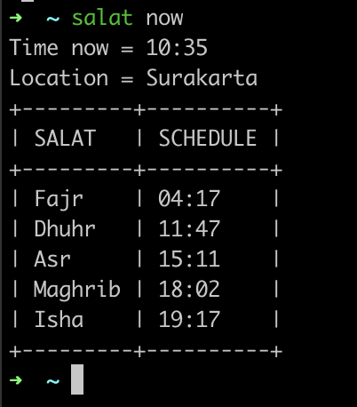

# Salat
Salat CLI helps you to know the time in Islam

## OS Support
- Linux (amd64, arm64)
- MacOS (amd64, arm64)

## How to install
- Running by script
    ```
    curl -sfL https://raw.githubusercontent.com/alfajrimutawadhi/salat/master/install.sh | bash -
    ```

## Features
1. Prayer Schedule  
The system will display the current time and prayer schedules based on location
<br><br>
You can change location with command `set-location`


2. Hijri Calendar   
The system will display a calendar based on your device's time
